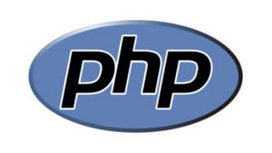

# Вокруг PHP – экосистема веб-приложений. Обучение в записи

## Содержание программы
 

  

### Урок 1. Лекция: Консольный PHP
### Урок 2. Семинар: Консольный PHP
- сделали первый и уверенный шаг в подготовке к собеседованию,
- потренировались в ответах на типичных вопросах
- научились работать в команде, понимать требования и выполнять задачи,
поставленные тимлидом
- научились разбивать задачу на более мелкие подзадачи, чтобы легче было
управлять проектом и следить за прогрессом
- сделали первый и уверенный шаг в создании бота, который будет напоминать о
важных событиях или задачах
- научились создавать демона, который будет выполнять определенные задачи в
фоновом режиме

### Домашнее задание 1 [hw-1](hw-1/README.md)
 

### Урок 3. Лекция: Backend API

### Урок 4. Семинар: Backend API
- потренировались отвечать на вопросы про API на собеседованиях
- научились работать в команде, понимать требования и выполнять задачи,
поставленные тимлидом
- научились разбивать задачу на более мелкие подзадачи, чтобы легче было
управлять проектом и следить за прогрессом
- сделали новый уверенный шаг в создании бота — создали интеграцию с Telegram
- научились работать с Telegram API и Postman

### Домашнее задание 2 [hw-2](hw-2/README.md)
 

### Урок 5. Лекция: Frontend API (текстовая лекция)
### Урок 6. Лекция: Тестирование приложений
### Урок 7. Семинар: Тестирование приложений
- потренировались отвечать на вопросы про тестирование на собеседовании
- научились работать в команде, понимать требования и выполнять задачи,
поставленные тимлидом
- научились разбивать задачу на более мелкие подзадачи, чтобы легче было
управлять проектом и следить за прогрессом
- сделали первый шаг в unit-тестировании

### Домашнее задание 3 [hw-3](hw-3/README.md)
 

### Урок 8. Лекция: Продвинутое unit-тестирование

### Урок 9. Семинар: Продвинутое unit-тестирование
- потренировались отвечать на вопросы про тестирование на собеседовании
- научились работать в команде, понимать требования и выполнять задачи,
поставленные тимлидом
- научились разбивать задачу на более мелкие подзадачи, чтобы легче было
управлять проектом и следить за прогрессом
- поработали с тестовыми двойниками (Mock Stub)
создали тестовое API
- создали отчеты о покрытии кода

### Домашнее задание 4 [hw-4](hw-4/README.md)
 

### Урок 10. Лекция: Кэширование в PHP

### Урок 11. Семинар: Кэширование в PHP
- потренировались отвечать на вопросы про кэширование на собеседовании
- научились работать в команде, понимать требования и выполнять задачи,
поставленные тимлидом
- научились разбивать задачу на более мелкие подзадачи, чтобы легче было
управлять проектом и следить за прогрессом
- узнали, какие операции есть в redis и как с ними работать
- научились кешировать участки кода

### Домашнее задание 5 [hw-5](hw-5/README.md)
 

### Урок 12. Лекция: Очереди в PHP

### Урок 13. Семинар: Очереди в PHP
- потренировались отвечать на вопросы про очереди на собеседовании
- научились работать в команде, понимать требования и выполнять задачи,
поставленные тимлидом
- научились разбивать задачу на более мелкие подзадачи, чтобы легче было
управлять проектом и следить за прогрессом
- узнали, как работать с RabbitMQ из консоли
- узнали, как работать с обменниками в RabbitMQ
- узнали, как работать с RabbitMQ в PHP
- научились выносить отдельные функции приложения в очередь
- научились писать адаптеры работы с очередями

### Домашнее задание 6 [hw-6](hw-6/README.md)
 

### Урок 14. Лекция: Доставка приложений

   

#### Все задания и домашние работы выполнять в одном репозитории на GitHub
#### Домашние работы сдавать ссылкой на файл в репозитории

  
