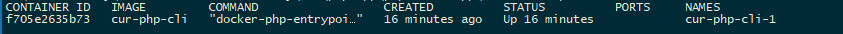

# Вокруг PHP – экосистема веб-приложений. Обучение в записи
## Консольный PHP
### Домашнее задание
<br><br>

1. Все задания с практики должны быть выполнены и загружены в репозиторий. <br><br> 
   В качестве выполненного домашнего задания присылайте ссылку на pull request. <br>
   Рекомендуется github, но можно использовать любой. <br> 
   Помните, что это ваш будущий проект, который вы будете защищать перед будущим работодателем, поэтому относитесь к нему соответствующе. <br><br>
2. Пришлите содержимое вашего crontab сообщением (вывод команды crontab -l) <br><br>
3. Опишите результат взаимодействия с systemctl. Как вы считаете в каких задачах использование демонов лучше, чем
   использование crontab? <br><br>
4. ⚹ Запустить демон с помощью systemd, вместо systemctl. Допустимо написать только worker.service файл. <br> <br>


Код с семинара, скачать и понять https://drive.google.com/file/d/1aW53N1R7cxP5OPtgifjrEWn2KkJVDXgU/view?usp=sharing <br>
Конфиг супервизора, положить в ```/etc/supervisor/conf.d```  <br> <br>

```
[program:worker]
process_name=%(program_name)s_%(process_num)02d
command=php8.2 ПУТЬДОФАЙЛА_RUNNER -c handle_events_daemon
autostart=true
autorestart=true
user=www-data
numprocs=1
redirect_stderr=true
stdout_logfile=/var/log/worker
```

```
php runner -c save_event --name 'name' --receiver 1 --text 'text' --cron '* * * * *' * * * * * php runner -c handle_events

```
<br><br>

### Домашнее задание

### [Проект 'cur' выполненный для Домашнего задания 1](../cur/)

1. Установить Docker Desktop в Windows с официального сайта <a href="https://docs.docker.com/desktop/setup/install/windows-install/" style="color: black; text-decoration: underline;text-decoration-style: dotted;">docs.docker.com/desktop/setup/install/windows-install/</a> или с <a href="https://hub.docker.com/" style="color: black; text-decoration: underline;text-decoration-style: dotted;">hub.docker.com/</a> и указать в переменной PATH.
2. Установить Composer в Windows с официального сайта <a href="https://getcomposer.org/download/" style="color: black; text-decoration: underline;text-decoration-style: dotted;">getcomposer.org/download/</a> и указать в переменной PATH.
3. Настроить путь к базе данных <a href="https://www.sqlite.org/" style="color: black; text-decoration: underline;text-decoration-style: dotted;">SQlite</a> в проекте, добавив запись в файл '.env'.
4. Создать таблицу event запросом к базе данных
```php
CREATE TABLE event (
id INTEGER PRIMARY KEY AUTOINCREMENT,
name TEXT NOT NULL,
text TEXT NOT NULL,
receiver INTEGER NOT NULL,
cron TEXT NOT NULL
);

```
5. Установить в корневую папку проекта файлы для запуска контейнера с docker:
- файл Dockerfile, который будет содержать инструкции для создания Docker-образа;
- файл docker-compose.yml, который будет содержать конфигурацию для запуска Docker-контейнера.
6. Создаем файл supervisord.conf в корневой директории. Этот файл будет содержать конфигурацию для Supervisor:
```php
[supervisord]
nodaemon=true

[program:worker]
process_name=%(program_name)s_%(process_num)02d
command=php /var/www/html/runner -c handle_events_daemon
autostart=true
autorestart=true
user=www-data
numprocs=1
redirect_stderr=true
stdout_logfile=/var/log/worker.log

```

7. Запустить в корневой папке проекта Composer
```php
composer install --ignore-platform-reqs
//или
composer install --ignore-platform-req=ext-pcntl

```

8. Запускаем проект в контейнере с помощью Docker Compose командой
```php
docker-compose up --build

```


### Содержимое crontab

Чтобы увидеть содержимое crontab внутри запущенного Docker-контейнера в Windows 10:

- Открываем терминал;
- Находим идентификатор (имя запущенного контейнера) с помощью команды:
```
docker ps

```


- Подключаемся к контейнеру с помощью команды:
```php
docker exec -it <container id (name)> /bin/bash
// например,
docker exec -it cur-php-cli-1 /bin/bash

```
- Внутри контейнера выполняем команду для просмотра crontab:
```
crontab -l

```


Выполняем команду для редактирования crontab:
```php
crontab -e

```
- Можно добавить cron-задачи.


- Запускаем cron-демона
```php
service cron start

```
 <br><br>
- Для остановки cron-демона, внутри контейнера выполним команду для остановки cron-демона:
```php
service cron stop

```


<br><br><hr>

### Инструкция

- Команда для CDM :
```php
docker-compose exec php-cli php runner -c save_event --name 'name' --receiver 1 --text 'text' --cron '* * * * *' && docker-compose exec php-cli php runner -c handle_events

```

- Команда для PowerShell:
```php
docker-compose exec php-cli php runner -c save_event --name 'name' --receiver 1 --text 'text' --cron '* * * * *'; docker-compose exec php-cli php runner -c handle_events

```

- Код записи в crontab:

```php
# Запуск команды save_event каждую минуту
* * * * * php /var/www/html/runner -c save_event --name 'name' --receiver 1 --text 'text'

# Запуск команды handle_events каждую минуту
* * * * * php /var/www/html/runner -c handle_events


```

- При запуске контейнера, если запускается с помощью docker run, можно использовать флаг --user root, где 'cur-php-cli-1' имя контейнера:
```php
docker run --user root -it cur-php-cli-1 /bin/bash

```
- После запуска контейнера можно проверить, что работает от имени пользователя root, выполнив команду:
```php
whoami

```

#### Дополнительные команды управления состоянием cron-демона в Docker-контейнере.

- Подключиться к Docker-контейнеру можно с помощью команды:
```php
docker exec -it <container_id_or_name> /bin/bash

```

- Запуск cron-демона:
```php
service cron start

```

- Перезапуск cron-демона:
```php
service cron restart

```

- Остановка cron-демона:
```php
service cron stop

```

- Проверка статуса, чтобы убедиться, что cron-демон остановлен:
```php
service cron status

```


<br><br><hr>
**В качестве решения приложить:** <br>
➔ ссылку на pull request в вашем репозитории с домашним заданием <br>
⚹ – дополнительное задание <br><br>