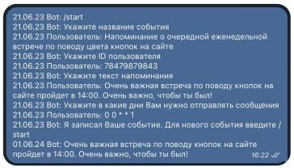
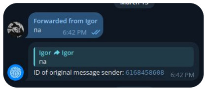

# Вокруг PHP – экосистема веб-приложений. Обучение в записи
## Backend API
### Домашнее задание

<br><br>
1. Сделайте новую ветку из той, которую мы создали на прошлом уроке. Это нужно для того, <br>
   чтобы мы могли работать с кодом из прошлого урока.<br><br>
2. Загрузите весь код из сегодняшнего урока в Git в новую ветку, создайте новый pull request. <br>
   Пришлите на проверку ссылку на pull request.<br><br>
3. Сегодня мы работали с вами с токеном Telegram. Какой тип аутентификации мы использовали?<br><br>



<br>
4. ⚹ На занятии мы создали класс TgMessagesCommand. <br>
   Сделайте так, чтобы он мог общаться с пользователем и запрашивать данные для сохранения расписания. <br><br>
   ⚹ – дополнительное задание <br><br>

#### Для решения доп. задания № 4 нужно:<br><br>
1. Создать из TgMessagesCommand демона<br><br>
2. Хранить всю историю сообщений, пришедших за время работы скрипта.<br><br>
3. Хранить offset получения сообщений в TgMessagesCommand <br><br>
4. Если пришло новое сообщение, то оно сохраняется в историю сообщений, после чего определяется какое
   сообщение мы должны отправить пользователю.
   Например, если пользователь отправил “/start” мы должны отправить “Укажите название события”, если пользователь отправил следующее сообщение после “/start” мы должны отправить “Укажите ID пользователя” и так далее. <br>
    Если мы получили 4 сообщения от пользователя (название события, ID пользователя, Текст напоминания и cron расписание), то мы сохраняем их в базу, а пользователю отправляем “Я записал Ваше событие. <br> 
    Для нового события введите /start”. Отправка сообщений пользователю происходит так же, как мы это делали в 1‑м задании, когда отправляли сообщения пользователю по расписанию.<br><br>


<br><br>
* Если вы хотите отправить сообщение не себе, то получатель должен начать диалог с вашим ботом. 
* Узнать идентификатор нужного вам пользователя вы можете, переслав боту @myidbot любое сообщение этого пользователя.
  <br><br>
### Решение задания
#### Задание 1. Подготовка ТЗ к интеграции с Telegram

1. Создать новый бот при помощи https://t.me/BotFather
2. Сохраняем полученный токен, переходим в наш бот и пишем (что угодно)
3. Узнать свой идентификатор в telegram. Для этого переходим в [Telegram: Contact @myidbot](https://t.me/myidbot) и получаем идентификатор
4. Переходим в [postman](https://www.postman.com/)
5. Начнем с получения сообщений. Для этого нам понадобится метод [getUpdates](https://core.telegram.org/bots/api#getupdates). [Тут](https://telegram-bot-sdk.readme.io/reference/getupdates) более интерактивная документация.
6. Мы можем получить сообщения просто обратившись get запросом по адресу <br>
   https://api.telegram.org/bot{token}/getUpdates <br>
   Также мы можем использовать get параметр offset. В него мы должны указать значение на 1 больше
   предыдущего полученного идентификатора сообщения (параметр update_id). Это будет полезно, когда мы будем реализовать получение сообщений в нашем скрипте.
7. Для отправки сообщения мы можем использовать метод [sendMessage](https://core.telegram.org/bots/api#sendmessage). [Тут](https://telegram-bot-sdk.readme.io/reference/sendmessage) более интерактивная документация. <br>
   Для этого нам нужно отправить POST запрос на https://api.telegram.org/bot{token}/sendMessage, в котором требуется передать 2 параметра: <br>
   ➔ chat_id(идентификатор пользователя, который получили в п. 3) <br>
   ➔ text(наш текст сообщения).

#### Задание 2. Реализация отправки сообщений в Telegram

1. Создать класс TelegramApi, который будет отвечать за отправку и получение сообщений. Создать 2 метода: getMessages и sendMessage
2. В класс EventSender (который мы создали на предыдущем уроке) добавить вызов метода sendMessage
3. Метод sendMessage обращается по пути
   https://api.telegram.org/bot{token}/sendMessage, передает chat_id и text.

#### Задание 2. Реализация отправки сообщений в Telegram
**Алгоритм:**
1. Добавьте в .env.example и .env токен Telegram
```php
TELEGRAM_TOKEN=

```
2. Реализуйте метод sendMessage() из интерфейса
```php
<?php
namespace App\Telegram;
interface TelegramApi
{
    public function ＿construct(string $token);
    /**
    * @return TelegramMessageDto[]
    **/    
    public function getMessages(int $offset): array;
    public function sendMessage(string $chatId, string $text);
}
```
В качестве отправителя можно использовать обычный curl:
```php
$ch = curl_init($url);
$jsonData = json_encode($data);
curl_setopt($ch, CURLOPT_POST, true); // Указывает, что отправляется POST запрос
curl_setopt($ch, CURLOPT_POSTFIELDS, $jsonData); // Прикрепляет данные
curl_setopt($ch, CURLOPT_HTTPHEADER, array('Content- Type:application/json')); // Устанавливает тип контента application/json
curl_setopt($ch, CURLOPT_RETURNTRANSFER, true);
curl_exec($ch); 
curl_close($ch);

```
3. В класс EventSender (который мы создали на предыдущем уроке) добавить вызов метода sendMessage
4. С помощью консольной команды php runner -c save_event из предыдущего урока добавьте в базу данных
   событие, которое будет отправлять в чат с вашим ID любое сообщение, например:
```php
php runner -c save_event --name 'Tеcтовая отправка' --receiver {Ваш ID, полученный от myidbot} --text 'Текст тестовой отправки сообщения' --cron '* * * * *'

```
5. И проверьте, что сообщение было доставлено вам с помощью команды из прошлого урока:
```php
php runner -c handle_events

```
#### Задание 3. Реализация получения сообщений из Telegram

1. Метод getMessages обращается по пути:
   https://api.telegram.org/bot{token}/getUpdates?timeout=1&offset={ID
   последнего полученного сообщения + 1}. <br>
   Сам экземпляр класса TelegramApi должен хранить offset либо метод getMessages должен принимать на вход параметр offset.
2. Для проверки результата getMessages можно создать App\Commands\TgMessagesCommand, в котором будем вызывать getMessages и выводить в консоль.

#### Задание 3. Реализация получения сообщений из Telegram. Алгоритм

1. Создайте новую команду App\Commands\TgMessagesCommand. Пусть она выводит в консоль все сообщения из чата при вызове команды
```php
php runner -c tg_messages
```

2. Реализуйте метод getMessages(int $offset) класса TelegramApiImpl
3. В TgMessagesCommand выведите в консоль результат вызова getMessages().
  


  <br><br><hr>

### Инструкция

#### Как использовать Curl в Windows

- Скачать установщик с официального сайта Curl и распаковать архив curl.zip.
- Переместить папку с Curl на диск C:\.
- Добавить папку Curl (обычно C:\Curl\bin) в переменную среды Windows PATH, чтобы можно было вызывать команду Curl из любого места.
- Ввести команду в командной строке, чтобы убедиться, что Curl можно использовать в Windows:
```php
curl --version

```
<br><br><hr>
**В качестве решения приложить:** <br>
➔ ссылку на pull request в вашем репозитории с домашним заданием <br>
⚹ – дополнительное задание