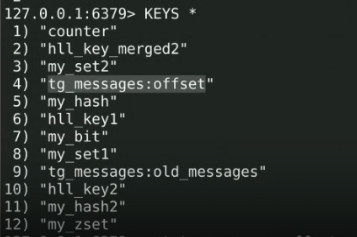

# Вокруг PHP – экосистема веб-приложений. Обучение в записи
## Кэширование в PHP
### Домашнее задание
<br><br>
1. Сделайте новую ветку из той, которую мы создали на прошлом уроке. Это нужно для того,
   чтобы мы могли работать с кодом из прошлого урока.<br><br>
2. Загрузите весь код из сегодняшнего урока в Git в новую ветку, создайте новый pull request.
   Пришлите на проверку ссылку на pull request.<br><br>
3. Завершайте работу над проектом. Доделайте прошлые домашние задания.<br><br>
4. ⚹ Улучшайте проект, чтобы им можно было гордиться! <br><br>

### Решение задания
#### Задание 1. Запускаем Redis и смотрим основные команды

Предлагают поработать с Redis из консоли и посмотреть на основные операции работы с различными типами данных. Но если вы используете виртуальную машину из инструментария, то там он уже установлен. Установить по [инструкции](https://timeweb.cloud/tutorials/redis/ustanovka-i-nastrojka-redis-dlya-raznyh-os) <br>
Redis можно установить в систему linux с помощью команды
```php
sudo apt-get update
// далее
sudo apt-get install redis-server
// или
sudo apt install redis-server -y

```
<br><br>

<hr style="margin: 20px 0; padding: 0;	height: 0;	border: none;	border-top: 2px solid #ddd; border-bottom: 2px solid #000;">

**Установка Redis в Docker** <br>

1. Для подключения Redis к проекту на PHP, который работает внутри Docker-контейнера, потребуется внести несколько изменений в файлы конфигурации (docker-compose.yml и Dockerfile) и добавить Redis в Docker-стек. <br>
Redis можно установить непосредственно в Docker-контейнер, что избавит от необходимости устанавливать его на локальном компьютере с Windows. Это также упростит управление зависимостями приложения. <br>
Нужно убедиться, что PHP-контейнер сможет общаться с Redis-контейнером, для этого добавить ссылку на Redis в environment раздела php-cli. <br> 
А чтобы PHP-код мог взаимодействовать с Redis, нужно установить в Docker-образе расширение php-redis. <br>
Файлам проекта на PHP понадобится доступ к Redis, что обычно делается с использованием библиотеки Predis или встроенного расширения php-redis. Тут можно выбрать любой из вариантов. <br>
2. Чтобы запустить Redis в отдельном сервере внутри Docker-контейнера, можно настроить docker-compose.yml таким образом, чтобы Redis работал в своем собственном контейнере. <br>
   Необходимо добавить сервис Redis в файл docker-compose.yml, указав параметры для запуска Redis-сервера:

```yml
environment:
      
      - REDIS_HOST=redis  # Указываем хост Redis
redis:
  image: redis:alpine
  ports:
    - "6379:6379"  # Открываем порт Redis для внешнего доступа
  command: redis-server --save 20 1 --loglevel warning  # Запускаем Redis-сервер с параметрами сохранения и логирования


```
3. Проверить, что в файле composer.json есть зависимость predis/predis. Если нет, добавить её вручную:   
   ```
   "require": {
     "predis/predis": "^1.1"
   }
   
   ```

<hr style="margin: 20px 0; padding: 0;	height: 0;	border: none;	border-top: 2px solid #ddd; border-bottom: 2px solid #000;">

<br><br>

#### Задание 2. Разбор ТЗ с тимлидом
Давайте определим: <br>
- Что будем кешировать?
- Какую библиотеку и какой инструмент мы будем использовать для кеширования?
  Со вторым вопросом определиться просто - мы будем использовать Redis и библиотеку predis. <br>
  Предлагаю сразу создать адаптер для работы с Redis
#### Задание 2. Разбор ТЗ с тимлидом
Алгоритм работы: <br>
1) Подключаем интерфейс **SimpleCache** <br>
2) Пишем адаптер <br>
3) Вспоминаем про стандарты Psr-6 и Psr-16 <br>
4) Дальше нужно решить, что кешировать (предлагаю кешировать offset и старые сообщения
   из телеграмм, которые используются в классе TgEvents) <br>
```php
//Подключаем интерфейс SimpleCache
composer require psr/simple-cache

```
Кешируем offset и старые сообщения из телеграмм, которые используются в классе TgEvents.

<br><br>

<hr style="margin: 20px 0; padding: 0;	height: 0;	border: none;	border-top: 2px solid #ddd; border-bottom: 2px solid #000;">

**Установка psr/simple-cache в Docker** <br>

PHP-пакет **psr/simple-cache** предоставляет общие интерфейсы для простого кэширования, соответствует стандартам PSR-16. <br>
Это не самостоятельная реализация кэша, а интерфейс, который описывает, как должна выглядеть реализация кэша. Он стандартизирует взаимодействие с кэшем в PHP, что позволяет разработчикам переходить между разными решениями для кэширования без значительных изменений в коде. <br>
Для использования в проекте нужно этот пакет включить через Composer. Например, для этого используется команда:
```composer require psr/simple-cache```

Документация по psr/simple-cache, включая связь со стандартом PSR-16, доступна в официальном файле спецификации на GitHub от [PHP-FIG](https://github.com/php-fig/simple-cache). <br>

Если требуется точно контролировать версии всех пакетов, используемых в приложении, включая пакеты для кэширования, то удачно добавление их в Docker-контейнер. <br>
Для установки пакета psr/simple-cache в Docker-контейнер, необходимо добавить соответствующую команду в Dockerfile.
```yml
RUN cd /var/www/html && composer require psr/simple-cache && composer install  # Устанавливаем пакет psr/simple-cache и обновляем зависимости

```
Этой строкой кода добавляем команду 'composer require psr/simple-cache', которая установит нужный пакет в контейнере при его запуске и развертывании проекта. Таким образом, одна команда RUN содержит части:
- composer require psr/simple-cache: добавляет пакет библиотеки psr/simple-cache в список зависимостей.
- composer install: обновляет зависимости проекта после добавления нового пакета.<br>


<hr style="margin: 20px 0; padding: 0;	height: 0;	border: none;	border-top: 2px solid #ddd; border-bottom: 2px solid #000;">

<br><br>


#### Задание 3. Подключаем Redis к боту

Решаем ТЗ, описанное в предыдущем задании.<br>
Запускаем проект.

```
php runner -c tg_messages

```

Добавляем сообщения в бот.<br>
Проверяем сообщения в Redis <br>


<br><br>

<hr style="margin: 20px 0; padding: 0;	height: 0;	border: none;	border-top: 2px solid #ddd; border-bottom: 2px solid #000;">

**Работа с консолью Redis в проекте Telegram-бота с Docker** <br>

Для запуска Docker-контейнера с PHP-программой на Windows нужно сначала убедиться, что установлен и запущен Docker Desktop, где должна быть настроена поддержка WSL2 (Windows Subsystem for Linux). <br>

Перейти в директорию проекта, где находятся файлы docker-compose.yml и Dockerfile. Собрать и запустить контейнеры с помощью Docker Compose. Эта команда выполнит сборку образа и запустит контейнеры, указанные в docker-compose.yml
```
docker-compose up --build

```

Для просмотра запущенных контейнеров выполнить команду 
```
docker ps

```
Чтобы остановить контейнер, требуется использовать команду 
```
docker stop <container_id> 
//или 
docker stop <container_name>

```

#### Работа с консольным приложением

- Подключиться к работающему контейнеру с PHP CLI. Эта команда откроет сессию внутри контейнера php-cli
```
docker-compose exec php-cli /bin/bash

```

- Перейти в рабочую директорию, если не открыта эта директория по умолчанию
```
cd /var/www/html

```

- Запустить PHP CLI приложение или выполните необходимые команды внутри контейнера можно командами php, например,
```
php runner -c tg_messages

```

#### Остановка контейнеров

Чтобы остановить контейнеры, выполнить следующую команду в отдельной командной строке. Эта команда остановит и удалит контейнеры, но сохранит образы и тома.
```
docker-compose down

```

##### Дополнительные команды

Следуя этим и другим командам, можно запускать и управлять PHP-CLI проектом в Docker-контейнере на Windows.

- Просмотр логов:
```
docker-compose logs -f

```
- Перезапуск контейнеров:
```
docker-compose restart

```


<hr style="margin: 20px 0; padding: 0;	height: 0;	border: none;	border-top: 2px solid #ddd; border-bottom: 2px solid #000;">

<br><br><hr>

## Перечень вопросов, которые также могут задать:
1. Какой основной минус кэширования? <br>
   **Ответ:** Основной минус кэширования заключается в том, что данные в кэше могут устаревать. Это требует сложной логики инвалидации кэша, чтобы гарантировать актуальность данных. <br><br>

2. Какие данные нельзя хранить в кэше? Почему? <br>
   **Ответ:** Нельзя хранить в кэше конфиденциальные данные, такие как пароли или персональные данные пользователей, из-за риска утечки информации. Также не рекомендуется кэшировать данные, которые часто изменяются, так как это может привести к несоответствию данных. <br><br>

3. Какие вы знаете типы кеширования? <br>
   **Ответ:** Существует несколько типов кеширования: кэширование данных (data caching), кэширование фрагментов (fragment caching), кэширование страниц (page caching), кэширование запросов (query caching) и кэширование объектов (object caching). <br><br>

4. Что такое проблема параллельных обновлений в кешировании? Какие подходы есть для ее исправления? <br>
   **Ответ:** Проблема параллельных обновлений возникает, когда несколько процессов одновременно пытаются обновить один и тот же кэш, что может привести к несогласованности данных. Для исправления используются подходы, такие как блокировки (locks) или версионирование данных. <br> <br>

5. Когда стоит думать про инвалидацию кеша? В начале проекта или после его запуска? <br>
   **Ответ:** Думать про инвалидацию кеша стоит на этапе проектирования системы, чтобы избежать проблем с устаревшими данными в будущем. <br><br>

6. Почему так важна инвалидация кеша? <br>
   **Ответ:** Инвалидация кеша важна для поддержания актуальности данных. Без нее пользователи могут получать устаревшие данные, что может привести к ошибкам и недовольству пользователей. <br><br>

7. Что можно, а что нельзя или не нужно материализовать? <br>
   **Ответ:** Можно материализовать результаты сложных и ресурсоемких вычислений, которые редко изменяются. Не нужно материализовать данные, которые часто обновляются или требуют постоянной актуальности. <br><br>

8. Что «дешевле»: материализация или кэширование? <br>
   **Ответ:** Кэширование обычно "дешевле" с точки зрения ресурсов, так как данные хранятся в оперативной памяти и быстро доступны. Материализация требует больше места на диске и может быть менее актуальной. <br><br>

9. Как правильно денормализовывать? В чём принципиальное отличие денормализации от материализации? <br>
   **Ответ:** Денормализация предполагает добавление избыточных данных в базу данных для ускорения чтения, но может усложнить обновление данных. Материализация — это предвычисление и сохранение результатов запросов. Основное отличие в том, что денормализация изменяет структуру данных, а материализация — способ их хранения. <br><br>

10. Что такое Memcached? Какое основное преимущество он имеет перед Redis? <br>
    **Ответ:** Memcached — это система кэширования в памяти, предназначенная для ускорения динамических веб-приложений. Основное преимущество перед Redis — простота использования и высокая производительность при работе с простыми структурами данных. <br><br>

11. Что такое Redis? Какие типы данных содержит? Какие основные команды помните? <br>
    **Ответ:** Redis — это in-memory хранилище данных, используемое как база данных, кэш и брокер сообщений. Поддерживает различные типы данных: строки, списки, множества, хэши и другие. Основные команды включают `SET`, `GET`, `LPUSH`, `RPOP`, `SADD`, `HSET`. <br><br>

12. Как в Redis повысить безопасность?
    **Ответ:** Для повышения безопасности Redis можно использовать аутентификацию, настроить сетевые правила для ограничения доступа, использовать SSL/TLS для шифрования данных и регулярно обновлять ПО. <br><br>

13. Что такое persistence в redis? Для чего используется? <br>
    **Ответ:** Persistence в Redis — это механизм сохранения данных на диск для предотвращения их потери при перезапуске сервера. Используется для обеспечения долговременного хранения данных. <br><br>

14. Есть ли в Redis транзакции? <br>
    **Ответ:** Да, в Redis есть поддержка транзакций с помощью команд `MULTI`, `EXEC`, `DISCARD` и `WATCH`, которые позволяют выполнять группы команд атомарно. <br><br>

15. Можно ли реализовать схему Pub/Sub(публикатор/читатель) в redis? <br>
    **Ответ:** Да, Redis поддерживает схему Pub/Sub, позволяя реализовать механизм обмена сообщениями между издателями и подписчиками.

<br><br><hr>

### Инструкция

Для выполнения работы с PHP CLI приложением внутри Docker-контейнера можно пррименять следующие команды:

1. **Запуск контейнера**
   Убедившись, что Docker-контейнер запущен, можно использовать docker-compose для запуска контейнера:
```
docker-compose up --build

```

2. **Доступ к контейнеру**
   После запуска контейнера, доступ к контейнеру можно получить с помощью команды docker exec, где заменить <container_name> на имя нужного контейнера. 
```
docker exec -it <container_name> /bin/bash

```
Имя контейнера можно узнать, выполнив команду ```docker ps```


3. **Выполнение команд внутри контейнера**
   После того как вошли в контейнер, можно выполнять команды PHP CLI, например:
```
php runner -c tg_messages

```
4. **Автоматизация запуска команды**
   Если требуется автоматизировать выполнение команды 'php runner -c tg_messages' при запуске docker, то можно добавить эту команду в конфигурацию Supervisor или изменить команду запуска в docker-compose.yml. Оба варианта позволят просто автоматизировать выполнение команды 'php runner -c tg_messages' при запуске docker-контейнера. 

- Если используется Supervisor, то можно добавить команду в конфигурацию Supervisor (supervisord.conf):
```
[program:php-runner]
command=php /var/www/html/runner -c tg_messages
autostart=true
autorestart=true
stderr_logfile=/var/log/php-runner.err.log
stdout_logfile=/var/log/php-runner.out.log

```
- Можно изменить команду запуска в файле docker-compose.yml, чтобы она выполняла требуемую команду PHP для конкретного консольного приложения:
```
services:
    php-cli:
        build: .
        volumes:
            - .:/var/www/html
            - ./database/database.sqlite:/var/www/html/database/database.sqlite
        environment:
            - TZ=Europe/Moscow
            - REDIS_HOST=redis
        command: /bin/bash -c "php /var/www/html/runner -c tg_messages && /usr/bin/supervisord"

```

#### Проблемы с кэшированием Docker

Иногда Docker может использовать кэшированные слои, которые не содержат последние изменения, чтобы очистить кэш Docker и пересобрать образ можно применить команду

```
docker-compose build --no-cache

```

#### Параметр имя проекта

Так как проект использует Composer, то название проекта указывается в файле composer.json в корневой директории проекта, где нужно проверить параметр "name" - reminder-tg-bot:
```php
{
"name": "rek771/reminder-tg-bot",
// ...
}
```
Если нет точной уверенности, где именно может находиться имя проекта, можно использовать инструменты поиска (командная строка) по проекту. Можно использовать команду grep в Unix-подобных системах (Linux, macOS) или findstr в Windows для поиска строки в проекте:
```php
grep -R "reminder-tg-bot" *
// или
findstr /R "reminder-tg-bot"

```
<br><br>


<br><br><hr>
**В качестве решения приложить:** <br>
➔ ссылку на pull request в вашем репозитории с домашним заданием <br>
⚹ – дополнительное задание